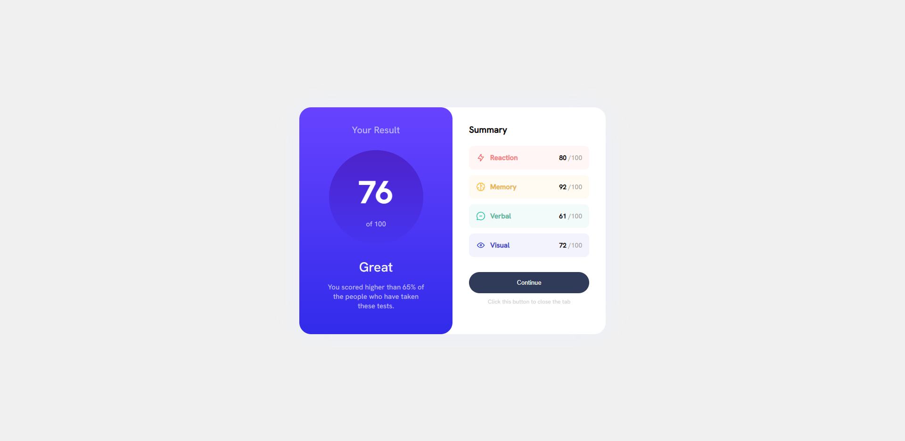

## Table of contents

- [Overview](#overview)
  - [The challenge](#the-challenge)
  - [Screenshot](#screenshot)
  - [Links](#links)
- [My process](#my-process)
  - [Built with](#built-with)
  - [What I learned](#what-i-learned)
  - [Continued development](#continued-development)
  - [Useful resources](#useful-resources)
- [Author](#author)
- [Acknowledgments](#acknowledgments)

## Overview

### The challenge

Users should be able to:

- View the optimal layout for the interface depending on their device's screen size
- See hover and focus states for all interactive elements on the page

### Screenshot

### Links

- Solution URL: [Here](https://www.frontendmentor.io/solutions/results-summary-component-skW4fONd2S)
- Live Site URL: [Here](https://darkxdev.github.io/results-summary-component/)

## My process

### Built with

- Semantic HTML5 markup
- CSS custom properties
- Flexbox
- [React](https://reactjs.org/) - JS library

Due to time constrains, this version of the project doesn't include a mobile version.

### What I learned

I used this project mainly to exercise my React skills since I'm new to it and still learning.

## Author

Bryan Hurtado

- GitHub: [@DarkxDev](https://github.com/DarkxDev)
- Frontend Mentor - [@DarkxDev](https://www.frontendmentor.io/profile/DarkxDev)
- Twitter: [@BryanHurtado_](https://twitter.com/BryanHurtado_)
